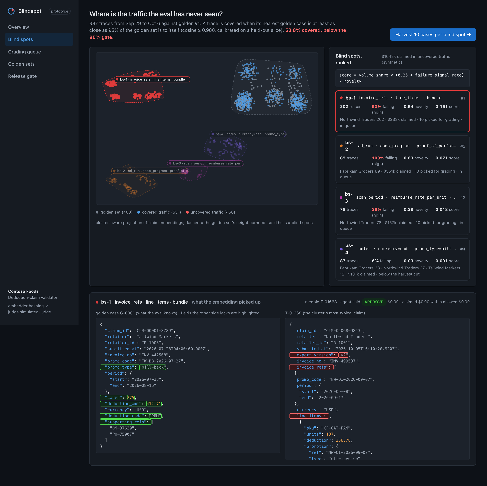
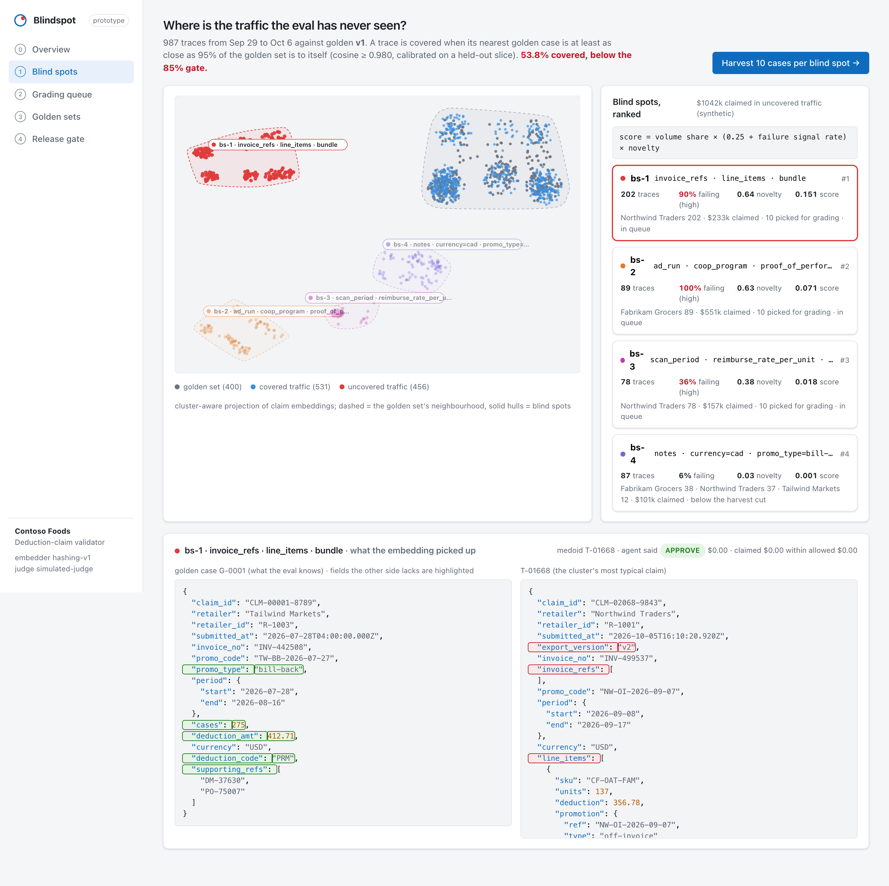
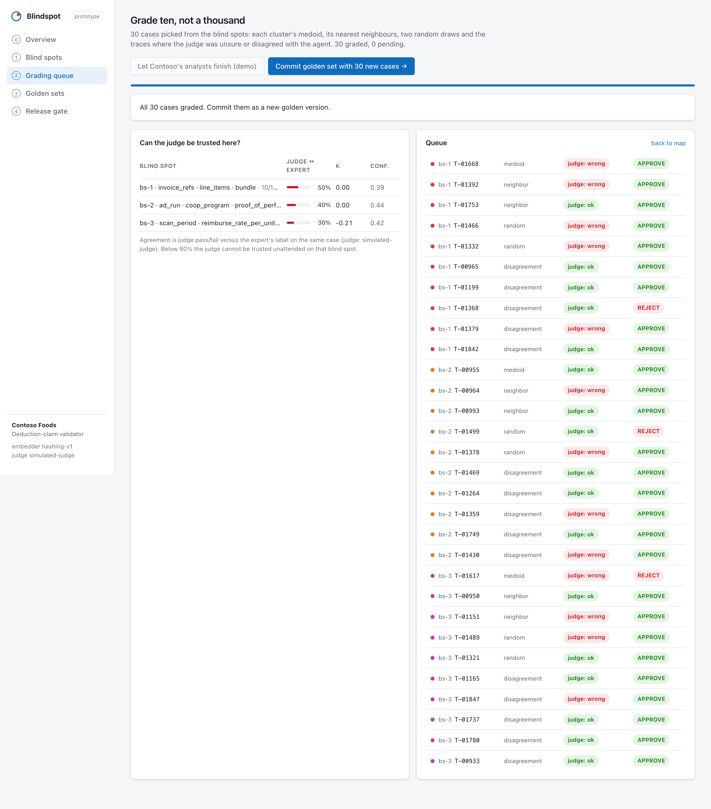
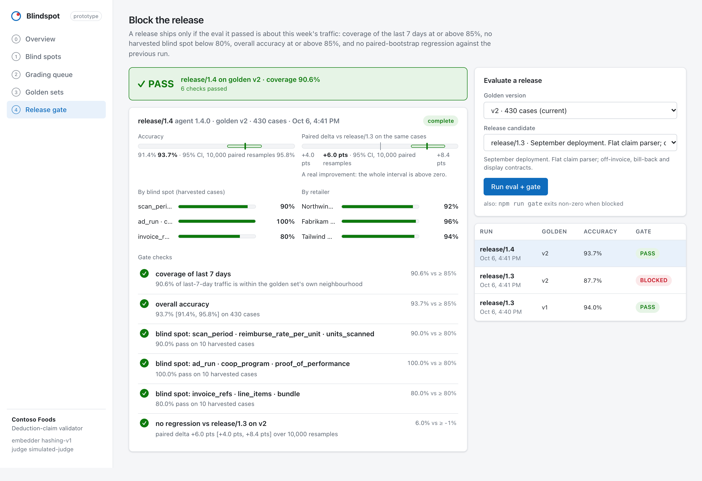
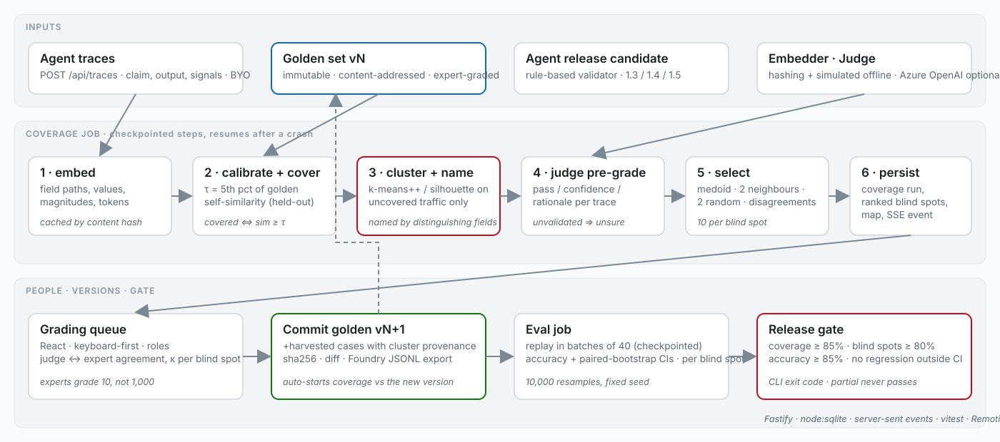

# Blindspot

**Foundry tells you your score. Blindspot tells you whether the score is about this week's traffic.**

Blindspot is a coverage gate for deployed AI agents. It measures how much of the last seven
days of production traffic the evaluation golden set actually resembles, clusters the traffic
the golden set has never seen into named *blind spots*, gets ten cases per blind spot graded by
a domain expert instead of a thousand, versions the result as a Foundry-compatible dataset, and
blocks a release whose 94% was a score about August.

Built as a product case study for Microsoft's forward-deployed engineering team (Microsoft
Delta), whose engagements start with "an evaluation harness, graded by domain experts, replayed
against historical decisions, and re-run on every release." Blindspot is the layer that keeps
that harness honest after deployment.



```bash
git clone https://github.com/ishitasamadhiya/blindspot.git
cd blindspot
npm install
npm run demo        # builds the web app, seeds a demo engagement, serves http://localhost:4040
```

No keys, no network at runtime, no native build step: Node 22.13+ is the whole requirement. `npm run
story` runs the same loop headless in about fifteen seconds and exits with the gate's status.

## Contents

- [The problem](#the-problem)
- [What already works](#what-already-works)
- [The missing layer](#the-missing-layer)
- [The solution, in three moves](#the-solution-in-three-moves)
- [Demo mode](#demo-mode)
- [What is real and what is seeded](#what-is-real-and-what-is-seeded)
- [Architecture](#architecture)
- [Technical decisions](#technical-decisions)
- [The math, briefly](#the-math-briefly)
- [Failure handling](#failure-handling)
- [Azure OpenAI mode](#azure-openai-mode)
- [Testing](#testing)
- [The video](#the-video)
- [Future improvements](#future-improvements)
- [Project structure](#project-structure)

## The problem

The demo engagement is Contoso Foods, a CPG manufacturer whose retailers (Northwind Traders,
Fabrikam Grocers, Tailwind Markets) short-pay invoices and submit trade-promotion deduction
claims. An agent validates each claim against Contoso's promo contracts and returns
APPROVE / REJECT / ESCALATE with a reimbursable amount. It was built in August from a golden set
of 400 historical claims graded by two deductions analysts, scored 94.3% on them, and was deployed
into Contoso's tenant in mid-September.

Three weeks later:

| | week before the migration (Sep 23–29) | last 7 days (Sep 30–Oct 6) |
|---|---|---|
| eval accuracy on golden v1 | 94.3% | 94.3% |
| analyst override rate in production | 4.0% | 25.2% |
| coverage of traffic by golden v1 | 91.1% | **53.8%** |

Both numbers in the last column are true at the same time. Northwind migrated to a new portal
whose export nests the deduction amount inside `line_items[]`; the parser finds no amount,
defaults it to zero, and *approves the claim for $0.00*. A scan-back promo type that did not
exist in any August contract is rejected every time. Fabrikam's co-op advertising claims arrive
with a tearsheet reference instead of an invoice and are escalated every time. None of those
shapes are in the golden set, so the eval cannot see any of it, and it stays green.

## What already works

Delta's practice is the right idea: a golden set built from real decisions, graded by the people
who own the outcome, replayed on every release. It is CI for agents. Microsoft Foundry also
already samples production traces into versioned evaluation datasets (intelligent sampling with
MinHash diversity and low-intent filtering, per the traces-to-dataset preview docs, September 2026)
and runs continuous evaluation on sampled production interactions. Those are the ingredients.
Blindspot does not replace them.

## The missing layer

What the existing tools do not surface as first-class numbers:

1. **A coverage number.** What fraction of this week's traffic sits within the golden set's own
   neighbourhood. A score should come with "...and this is about 54% of what the agent sees."
2. **Blind spots of *uncovered* traffic, not low-scoring traffic.** When a new claim shape appears,
   the judge was never validated on it either, so "low score" is not a trustworthy signal there.
   Blindspot clusters by content and ranks by `volume share × (0.25 + failure-signal rate) × novelty`.
3. **Judge agreement per blind spot.** How much of the eval can run unattended, and where it cannot.
4. **Intervals on release deltas.** A paired bootstrap over the same cases, so a two-point move is
   not mistaken for a regression (or an improvement).
5. **A release gate on representativeness**, with golden versions exported in Foundry's dataset
   schema so the gate complements Foundry evaluations instead of replacing them.

## The solution, in three moves

### 1. Find the traffic the eval has never seen

Every claim is embedded (field paths, categorical values, number magnitudes, free-text tokens);
the coverage threshold is calibrated on the golden set itself (a held-out slice, 5th percentile of
nearest-neighbour similarity, so "covered" means "at least as close to a golden case as 95% of the
golden set is to itself"); uncovered traffic is clustered (k-means++ with silhouette selection) and
each cluster is **named from the fields that set it apart** from the golden set, never from a label
anyone typed:

```
bs-1  invoice_refs · line_items · bundle                    n=202  fail=90.1%  novelty=0.64  score=0.1505
bs-2  ad_run · coop_program · proof_of_performance          n= 89  fail=100%   novelty=0.63  score=0.0712
bs-3  scan_period · reimburse_rate_per_unit · units_scanned n= 78  fail=35.9%  novelty=0.38  score=0.0181
bs-4  notes · currency=cad · promo_type=bill-back           n= 87  fail=5.7%   novelty=0.03  score=0.0009
```

The fourth cluster is real but harmless (resubmissions with a note, Canadian claims) and the ranking
puts it last; clusters under a reporting floor (12 traces or 3% of the window, whichever is larger) are summarised as a long tail.



### 2. Grade ten, not a thousand

Each blind spot sends its medoid, the two nearest neighbours, two random draws, and the traces where
the judge was unsure or disagreed with the agent. The judge pre-grades every case and the queue
measures judge-versus-expert agreement (and Cohen's κ) per blind spot: here it is 30–50% with mean
confidence 0.4, which is the system saying *do not trust me unattended on this cluster yet*.



Graded cases commit to an immutable, content-addressed golden version (`v2`: 430 cases, +30 from
three blind spots) that exports as a Foundry evaluation dataset (`query`, `response`,
`ground_truth`, `context`); `response` carries the latest completed evaluation's outputs for that version.

### 3. Block the release

A release ships only if the eval it passed is about this week:

| check | rule |
|---|---|
| coverage of last 7 days | ≥ 85% |
| each harvested blind spot (n ≥ 8) | pass rate ≥ 80% |
| overall accuracy | ≥ 85% |
| regression vs. baseline | paired-bootstrap 95% interval's upper bound ≥ −1 pt |
| run status | a partial run never passes |



On the demo data: release/1.3 re-run on golden v2 scores 87.9% [84.7, 90.9] with 0%, 0% and 10% on
the three blind spots and is **blocked**. A fourteen-line parser patch (release/1.4) scores 94.0%
[91.6, 96.0], +6.0 pts [4.0, 8.4] paired against 1.3, coverage 90.6%, and **passes**. A control
release that moves the number by −0.9 pts [−2.8, +0.9] also passes: the interval includes zero, so
the gate does not cry wolf. `npm run gate` prints the checks and exits non-zero when blocked.

## Demo mode

```bash
npm run demo          # build web, seed, serve on :4040 (set PORT or BLINDSPOT_PORT to change)
npm run dev           # development: API on :4040 with reload, Vite on :5173 with proxy
npm run story         # the whole loop headless; exit code = release/1.4's gate (0 PASS, 1 BLOCKED)
npm run gate          # the latest run's gate (or --run <id>); exit 0 PASS, 1 BLOCKED, 2 no gate yet
npm run seed -- --days 14   # reseed with all 14 days ingested (no replay step)
```

The seeded engagement starts with golden v1, the first week of traffic, a baseline evaluation and
a coverage run. The demo path in the UI:

1. **Overview** → *Replay next 7 days of traffic* (streams 987 traces over ~18 s; the override-rate
   chart moves live) → *Run coverage on last 7 days*.
2. **Blind spots** → inspect the map and the golden-vs-medoid diff → *Harvest 10 cases per blind spot*.
3. **Grading queue** → grade cases yourself (`a` / `r` / `e`, Enter) or *Let Contoso's analysts
   finish (demo)* → *Commit golden set*.
4. **Release gate** → evaluate release/1.3 (blocked), release/1.4 (pass), release/1.5 (pass, noise).

Bring your own traces with `POST /api/traces` (array of `{trace_id, received_at, claim, output, signals}`).

## What is real and what is seeded

Seeded, from a fixed RNG seed (`packages/core/src/seed.ts`): the golden set (400 historical
claims), 14 days of production traces, and the analysts' hidden labels. The retailer's portal-v2
export, the scan-back promo and the co-op claims are seeded as *traffic shapes*, never as cluster
labels.

Computed by the code in this repo, from that data: the embeddings, the coverage threshold, the
clusters and their names, the blind-spot ranking, the representative selection, the agent's
decisions (a real rule-based validator whose release 1.3 fails on portal-v2 claims because the
parser cannot find the amount), the judge's pre-grades, the bootstrap intervals, κ, and every
gate verdict.

Simulated, and labelled as such in the UI: the judge in offline mode (`SimulatedJudge`) re-derives
a verdict from the fields it recognises, agrees with the hidden labels about 85% of the time on
familiar shapes (it knows nothing about the period or duplicate rules and flips a further 8% of
verdicts) and is visibly unsure on unfamiliar ones, which is the behaviour an unvalidated LLM judge
has in practice. The
"let the analysts finish" button fills expert labels from the seed. With Azure OpenAI configured,
the judge and the embedder are real.

The only aggregate dollar figure on screen is "claim value in uncovered traffic" and its per-cluster
breakdown, summed from seeded per-claim amounts and marked synthetic; the individual amounts on
claims, grades and golden cases are the seeded values themselves.

## Architecture



```
apps/web        React 19 + Vite + TypeScript. Five screens; pure presentational components
                (the video renders the same components with recorded data).
apps/server     Fastify + Node's built-in SQLite. REST, server-sent events, a checkpointing job
                runner, demo seeding/replay, optional Azure OpenAI adapters, CLI.
packages/core   The algorithms, dependency-free, with unit tests on the math and the agent: embedder,
                coverage, clustering and naming, selection, stats, agent under test, judge, gate, seed.
video           Remotion composition for the demo video (scenes reuse apps/web components).
```

**Data flow.** Traces arrive by `POST /api/traces` (or the demo replay). A *coverage* job embeds
the window and the golden version, calibrates the threshold, scores coverage, clusters the uncovered
traffic and names each cluster, has the judge pre-grade the uncovered traces, selects
representatives, lays out the map, and persists a coverage run. *Harvest* turns selections into
grading items. Grades commit to a new golden version, which automatically starts a coverage run
against the new version. An *eval* job replays the version through an agent release in batches,
aggregates with bootstrap intervals, and evaluates the gate (waiting for an in-flight coverage job
if needed). Everything emits events on `/api/events`, which the UI (and the CLI) subscribe to.

**Durable jobs.** `apps/server/src/jobs.ts` is a small runner with the contract that matters:
every step checkpoints to SQLite before the next starts, steps are written to be safely re-run
(ids are allocated up front and writes are upserts), and on restart the runner resumes incomplete
jobs at the first unfinished step. The eval job checkpoints per batch of
40 cases (including the agent's duplicate-invoice state) so a crash mid-run resumes rather than
restarts. In production this maps onto Azure Durable Functions or Temporal activities without
changing the step bodies.

**REST surface** (all under `/api`): `overview`, `events` (SSE), `traces` (GET/POST),
`demo/replay`, `demo/reset`, `coverage/run`, `coverage/latest`, `coverage/runs/:id`, `blindspots`,
`harvest`, `grading/queue`, `grading/agreement`, `grading/:id` (POST), `demo/simulate-analyst`,
`golden/versions`, `golden/:v`, `golden/diff`, `golden/:v/export.jsonl`, `golden/commit`,
`agent/versions`, `eval/run`, `eval/runs`, `eval/runs/:id`, `gate/latest`, `gate/:id`, `jobs`,
`jobs/:id`, `jobs/:id/retry`.

## Technical decisions

| decision | why | what it cost |
|---|---|---|
| Threshold calibrated on the golden set (held-out 5th percentile) instead of a fixed cosine cut-off | "covered" is defined relative to how tight the golden set itself is, so it transfers across engagements and embedders | 5% of a perfectly in-distribution stream is flagged uncovered by construction; the reporting floor keeps that from becoming fake blind spots |
| Cluster the *uncovered* traffic, not the low-scoring traffic | on a new shape the judge is unvalidated too; low score is not a trustworthy signal there | a cluster can be uncovered and harmless (bs-4), so ranking by failure signals and novelty matters |
| Hashing embedder over field paths and values as the offline default | zero dependencies, deterministic, and structure is exactly what distinguishes a new export format | weaker on free-text semantics; swap in `text-embedding-3-small` via env behind the same `Embedder` interface (a local MiniLM is on the roadmap) |
| Cluster-aware map layout (global PCA for placement, local PCA inside each group, seeded jitter) | raw PCA of near-identical structured claims collapses every shape to a dot | the map's distances are meaningful within a group, not between groups; the legend says so |
| Expert selection = medoid + neighbours + random + judge disagreements, budget 10 | the medoid teaches the shape, random draws catch what "typical" misses, disagreements spend expert time where the judge wobbles | not active learning; a v2 would pick by expected information gain |
| Paired bootstrap (10k resamples, fixed seed) on release deltas | the same cases are scored by both releases; pairing removes case difficulty from the variance | 10k resamples over 430 cases takes well under 100 ms in JS; fine for a gate |
| Gate on coverage *and* per-blind-spot pass rate *and* regression interval | each catches a failure the others miss: a stale set, a known-bad region, and random noise | more things to explain; the checks list is the explanation |
| Node's built-in `node:sqlite` | no native build step, so `npm install` works everywhere; real SQL for jobs and versions | marked experimental in Node 22; the data layer is one file if it needs to move |
| Immutable, content-addressed golden versions exported as Foundry JSONL | reproducible evals and a path into Foundry's own evaluation flow | the export is the standard query/response/ground_truth/context shape; Blindspot's cluster metadata rides in `context` |

## The math, briefly

- **Coverage.** For each trace, `max cosine(trace, golden)`; covered if `≥ τ` where `τ` is the 5th
  percentile of the same quantity computed for a held-out 20% of the golden set against the rest.
- **Blind-spot score.** `volume_share × (0.25 + failure_rate) × novelty`, with `failure_rate` the
  share of traces that were overridden by an analyst, escalated, hit a tool error, or were approved
  for $0, and `novelty = 1 − mean nearest-golden similarity`. The constant keeps a large, novel,
  not-yet-failing cluster visible.
- **Cluster naming.** Tokens are field paths, categorical values and promo-code prefixes; a token's
  score is its frequency inside the cluster minus its frequency in the golden set; one token per
  top-level field, nested fields preferred.
- **Intervals.** Percentile bootstrap of the mean pass indicator; paired delta resamples case pairs.
- **Agreement.** Judge pass/fail vs. expert label on the same case, plus Cohen's κ (needs ≥ 4 cases).

## Failure handling

- A coverage or eval job that dies resumes at its last checkpoint on the next start (`resumeIncomplete`).
- An eval run that is not `complete` **never** passes the gate.
- If Azure embeddings fail mid-run the embedder degrades to the hashing embedder for the whole run
  (golden and traffic are embedded in one call, so a run never mixes vector spaces), emits a warning
  event and records the fallback on the coverage run; if the Azure judge fails it degrades to the
  simulated judge and says so in every verdict.
- A golden version with no coverage run gets one automatically before its gate is evaluated.
- The browser's event stream reconnects when server pings stop, and every live view also polls.
- Release gate evaluation is deterministic: same data, same seed, same verdict.

## Azure OpenAI mode

```bash
cp .env.example .env   # then set:
AZURE_OPENAI_ENDPOINT=https://<resource>.openai.azure.com
AZURE_OPENAI_API_KEY=...
AZURE_OPENAI_EMBEDDING_DEPLOYMENT=text-embedding-3-small
AZURE_OPENAI_CHAT_DEPLOYMENT=gpt-4o-mini
```

With these set, `text-embedding-3-small` embeds the claim JSON and `gpt-4o-mini` grades agent
decisions against the deduction rubric (JSON verdicts with a confidence). The UI shows which
embedder and judge are in use.

## Deploying

One container serves the API and the built web app; the SQLite file lives on a volume.

```bash
docker build -t blindspot .
docker run -p 4040:4040 -v blindspot-data:/data blindspot
```

That image runs as-is on Azure Container Apps or App Service for Containers (set `PORT` if the
platform assigns one, `BLINDSPOT_DB` to a mounted path, and the `AZURE_OPENAI_*` variables to
turn on the real embedder and judge). The Dockerfile mirrors the npm commands above; it was
written on a machine without Docker, so build it once before relying on it. `.github/workflows/ci.yml` runs the typecheck, the tests
and `npm run story`, so the release gate's exit code is what makes the build green.

## Testing

```bash
npm test          # core: 21 vitest cases · server: API flow + durable-runner resume
npm run typecheck # core, server, web
```

Server tests drive the whole loop through the REST API in memory (replay → coverage → harvest →
grade → commit → eval → gate, including the Foundry export shape and malformed-ingest rejection)
and prove the job runner resumes at a failed step and never re-runs a finished one.

Core tests cover: seeded RNG reproducibility; bootstrap interval behaviour (brackets the mean, zero for
identical runs, includes zero for two-sided flips); Cohen's κ; embedder determinism and structure
sensitivity; threshold calibration and coverage of the golden set against itself; clustering of
separated blobs and determinism; cluster naming; representative selection roles and budget; the
agent's release-1.3 zero-dollar approval and the release-1.4 fix; gate rules including the partial
run and the noise-versus-regression distinction.

## The video

`video/` is a Remotion project whose scenes render the real React components with data recorded
from `npm run story -- --snapshot video/src/data/snapshot.json`. The voice-over is synthetic (a
Microsoft neural voice through Edge TTS, `pip install edge-tts`; falls back to macOS `say`), and
the sound design (clicks, whoosh, stamp, ping, riser, ambient bed) is synthesised from scratch by
`video/scripts/sound.py`, so nothing in the video needs a licence.

```bash
npm run video:tts            # narration clips from docs/video/narration.md + timing.json (ENGINE=say to use macOS voices)
npm run video:sound          # sound effects and the ambient bed into video/public/audio/sfx/
npm run video:render         # video/out/blindspot-demo.mp4 (1080p, H.264); DemoSilent has no narration
npm run video:studio         # scrub scenes in the Remotion studio
```

To use your own voice, record each line of `docs/video/narration.md` as
`video/public/audio/<scene>.wav`, update `video/src/data/timing.json` with the clip lengths, and
render again; scene lengths follow the clips.

The opening scene shows a headshot read from `video/public/photo/headshot.jpeg`; that folder is
git-ignored, so drop your own photo there before rendering.

## Future improvements

- **Foundry integration.** Read traces from Application Insights through the Foundry SDK and write
  golden versions as Foundry datasets directly, instead of JSONL export.
- **Judge auto-accept.** When a blind spot's κ clears 0.7 on ≥ 8 graded cases, let the judge grade the
  rest of that cluster and keep a rolling expert audit sample.
- **Active learning.** Replace medoid + random with selection by expected disagreement reduction.
- **Dollar-weighted everything.** Weight coverage, pass rates and the gate by claim value at risk.
- **Durable Functions / Temporal.** Lift the job runner onto a real workflow engine; the step contract
  is already activity-shaped.
- **Per-engagement tenancy.** One deployment per customer tenant; no cross-customer view.
- **Semantic embeddings offline.** `all-MiniLM-L6-v2` via ONNX behind the same `Embedder` interface.
- **Drift over time.** Coverage as a time series with alerting when a seven-day window drops below the
  gate threshold, before anyone cuts a release.

## Project structure

```
packages/core/src   agent.ts cluster.ts contracts.ts coverage.ts embed.ts gate.ts golden.ts
                    judge.ts layout.ts pipeline.ts prng.ts seed.ts select.ts stats.ts vector.ts
packages/core/test  stats, coverage, cluster/selection, agent+gate
apps/server/src     app.ts azure.ts cli.ts db.ts events.ts jobs.ts main.ts routes.ts services.ts
apps/web/src        components/ pages/ lib/ styles.css
video/src           Root.tsx scenes/ components/ data/snapshot.json data/timing.json
docs                architecture.svg screenshots/ video/narration.md decisions.md
scripts             screenshots.mjs
```

MIT © 2026 Ishita Samadhiya
